    <h3><code>svr@github ~ $ ./contributions.sh</code></h3>
    
      
    <h3><code>svr@github ~ $ whoami</code></h3>
    <table>
        <tr>
            <td valign="top"></td>
            <td valign="top"></td>
        </tr>
    </table>
      
    <h3><code>svr@github ~ $ ./links.sh</code></h3>
    
<b>Full Stack Developer · AI Builder · Blogger</b>

<h3><code>svr@github ~ $ ./dsa.sh</code></h3>

<b>Full Stack Developer · AI Builder · Blogger</b>

